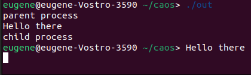
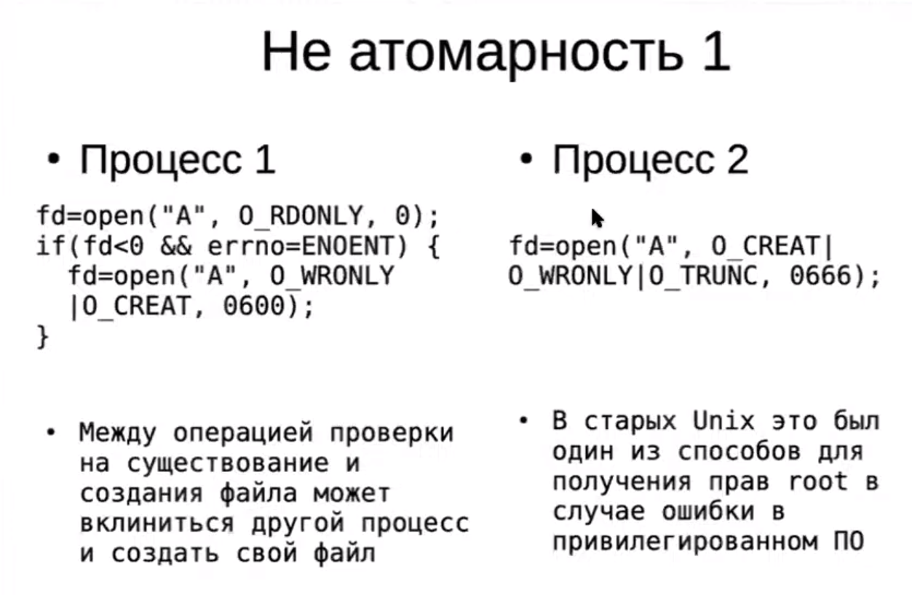
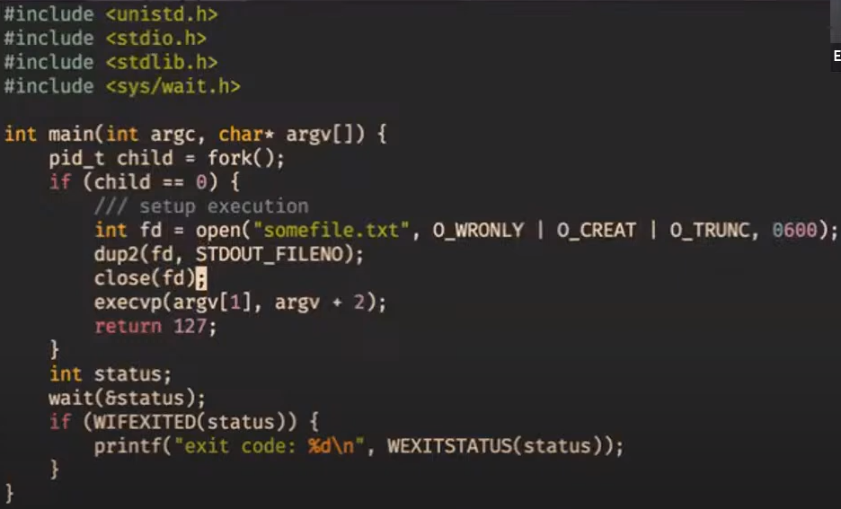

# Процессы

*Процесс* - это запись в таблице процессов :-) в памяти ядра.
У процесса есть числовой идентификатор (PID, process ID),
собственная виртуальная памяить, таблица файловых дескрипторов
и некоторые другие вещи, о которых речь будет позже.

Любая программа, которую мы написали и запустили, выполняется в созданном для неё *процессе*.

## Команда `ps`

    $ ps [OPTIONS] # информация о запущенных процессах

Пример использования:

    $ ps aux

* Опция `a` указывает ps вывести на дисплей процессы всех пользователей, за исключением тех процессов, которые не связаны с терминалом и процессами группы лидеров.
* Опция `x` в ps перечисляет процессы без управляющего терминала. В основном это процессы, которые запускаются во время загрузки и работают в фоновом режиме.
* Опция `e` указывает ps отобразить все процессы.
* Опция `f` — полноформатный список, который содержит подробную информацию о процессах.

## Файловая система proc

`/proc` — это виртуальная файловая система. Ее основная задача — получение от ядра сведений о выполняющихся процессах.

    $ ls /proc # вывод в консоль директории виртуальных каталогов и подкаталогов


## Статусы процеса

Поле STAT в выводе ps указывает на состояние процесса. Некоторые частые состояния:
* `R` - running/runnable, исполняется/готов к исполнению;
* `S` - sleeping, ожидает возвращения из системного вызова;
* `T` – stopped, остановлен пользователем;
* `Z` – zombie.

Некоторые редкие состояния:
* `t` – остановлен отладчиком;
* `D` - uninterruptible sleep, состояние обычно указывает на аппаратный сбой или нештатное состояние системы.

### Нужные системные вызовы

* Системный вызов `sleep` - процесс будет спать в течение заданного количества секунд.

* Системный вызов `pause` - заставляет вызывающий процесс спать до тех пор, пока не поступит *сигнал*.

* Системный вызов `wait` приостанавливает выполнение вызывающего процесса, пока не завершится один из его дочерних процессов.

## Как породить новый процесс?

Системный вызов `fork` - полностью копирует процесс, который его вызвал. Важно
понимать, что хоть у них пространства виртуальной памяти изначально идентичные
(сразу после копирования), они всё же отдельные. То есть изменение переменной
в одном процессе не поменяет её в другой.

### Как это использовать

```c
#include <unistd.h>
#include <stdio.h>

int main () {
    fork();
    printf("hello world from %d\n", getpid()); // id процесса - это целое число
}
```

Данный код приведёт к тому, что pid выведется дважды, и это будут два разных
числа. Важно понимать, что зацикливания не произойдёт, так как новый процесс
начнёт выполняться с момента строго после `fork()`. Более наглядно это будет,
если посмотреть на output кода ниже.

```c
#include <unistd.h>
#include <stdio.h>

int main () {
    printf("parent process\n");
    fork();
    printf("hello world from %d\n", getpid());
}
```

**OUTPUT:**
```
parent process
hello world from 2991610
hello world from 2991611
```

Так как виртуальная память копируется, то любые изменения переменных в склонированном процессе будут локальными, однако иметь одинаковые адреса. Наглядно это можно увидеть из примера кода ниже.
```c
#include <unistd.h>
#include <stdio.h>

int x = 0;

int main () {
    fork();
    ++x;
    sleep(1); // для надёжности усыпим процесс, чтобы x успели поменять оба
    printf("x = %d, &x = %d\n", x, &x);
}
```
**OUTPUT:**
```
x = 1, &x = 0x55f9 // разумеется, реальный адрес будет длиннее,
x = 1, &x = 0x55f9 // но для наглядности взят короткий
```

Как же тогда в самом процессе понять дочерний он или родительский? Посмотреть на возвращаемое значение функции `fork`. В родительский процесс она возвращает `PID` дочернего, а в дочерний возвращает `0`. В случае ошибки возвращаемое значение равняется `-1`.
Из этого также следует, что `PID` начинаются с `1`.

Задан ли порядок выполнения родительского и дочернего процессов? Нет. Они могут выполняться в любом порядке и никак не синхронизированы.

Зачем нам вообще нужно, чтобы в системе было много процессов? Например, чтобы разные пользователи могли запускать программы, или один пользователь мог одновременно запустить несколько программ.

Что будет, если родительский процесс убить до того, как дочерний завершится? Для этого давайте посмотрим как будет выглядеть консоль целиком после выполнения кода ниже.

```c
#include <unistd.h>
#include <stdio.h>

int main () {
    pid_t id = fork();
    if (id == 0) {
        printf("child process\n");
        sleep(2);
    } else {
        print("parent process\n");
    }
    printf("Hello there\n");
}
```



Что нужно знать про системный вызов `wait`? Если дочерний процесс уже завершился, а родительский ещё нет, то дочерний переходит с состояние `zombie/defunct process`, так как понимает, что родительский процесс всё ещё может захотеть вызвать `wait`.

## Системный вызов для файлов

### Что происходит при вызове open?

* Создаётся file descript**ion**.
* В таблицу c file descript**ors** передаётся ссылка на данный file descript**ion**.
* Индекс данной ссылки возвращается как результат системного вызова.

У процесса таблица file descript**ors** представляет из себя массив из указателей на file descript**ions**.

Сами file descript**ions** никак не привязаны к процессу.

### Что происходит с файловыми структурами при системных вызовах?

* `fork`:
  * struct file - увеличения счётчика указателей
  * таблица file descript**ors** никак не изменится
* `close`:
  * уменьшение счётчика указателей
  * file descript**ion** уничтожается, если на файл больше никто не указывает
* `lseek`:
  * меняется позиция в file descript**ion**

**Важный факт:** для разных процессов, читающих один и тот же файл, позиция считывания общая. То есть, когда читает один из процессов, указатель откуда чтение продолжится сдвигается для всех.

## Атомарность

В чём состоит вопрос?
Не получится ли так, что мы из двух процессов выполняем чтение или запись с одним и тем же файлом, и позиции чтения и записи будут как-то несогласованы (помним, что указатель на текущую позицию в файле общий для процессов)?

### Пример неатомарности



Решение: добавить флаг `O_EXCL`, таким образом файл не будет создан заново.

### Пример для логирования

Использование флага `O_APPEND` будет выполнять перемещение указателя на место записи в файле в самый конец и саму запись в данную позицию (то есть в конец файла) **атомарно**.

### Ужасающий пример отсутствия атомарности

POSIX (стандарт) - не даёт гарантий атомарности на запись или чтение из файла. Например результатом `write("123")` и `write("abc")` из разных процессов может быть `"1a2b3c"`.

Но можно расслабиться, Linux запишет всё без перемешивания.

## Замещение тела процесса — семейство системных вызовов `exec*`

### Что происходит при вызове

* PID не меняется
* Создаётся новое пространство виртуальной памяти
* В данную виртуальную память загружается бинарный файл и начинается его исполнение

### Пример для понимания

```c
#include <unistd.h>
#include <stdio.h>

int main() {
    execv(...);
    perror("Error\n");
}
```
Сообщение об ошибке не выведется, так как данный процесс начнёт исполнять уже другой бинарный файл.

### Запуск другой программы в отдельном процессе

```c
#include <unistd.h>
#include <stdio.h>

int main() {
    pid_t child = fork();
    if (child == 0) { // если мы в дочернем процессе
        execv(...);
    }
    int status;
    wait(&status);
    printf("Some code here"\n);
}
```
Здесь мы имеем, что дочерний процесс отдаст свои ресурсы под выполнение бинарного файла, а родительский продолжит выполнять свой код дальше. `wait` добавили, чтобы родительский процесс сначала дождался выполнения дочернего процесса.

### dup2

Системный вызов делает так, чтобы определенный файловый дескриптор (передаётся по номеру), смотрел туда же, куда и другой файловый дескприптор (тоже передаётся по номеру).

Пример использования:



# Сигналы

## Что такое сигналы

В UNIX-подобных ОС для передачи информации процессам используются сигналы. Сигнал -- это число, которое ядро передаёт процессу. Определённые числа (коды сигналов) обозначают определённые события со стороны системы или пользователя. Например, 
- `SIGSEGV` -- сигнал процессу завершиться, который обычно приводит к появлению сообщения "Segmentation fault" в терминале;
- `SIGINT` -- прерывание с клавиатуры, посылается с помощью Ctrl+C.

## Диспозиция сигналов

Диспозиция ядра по отношению к сигналу определяет, как процесс будет реагировать на этот сигнал. Для каждого сигнала определена диспозиция по умолчанию, одна из этих:

- **Term** -- завершать процесс.
- **Ign** -- игнорировать.
- **Core** -- Term + записать память процесса на диск.
- **Stop** -- приостановить процесс.
- **Cont** -- возобновить приостановленный процесс.

## Обработчики сигналов и функция signal

На все сигналы, кроме `SIGKILL` и `SIGSTOP`, можно написать свой обработчик. Пример:

```c
void sayhi(int signo) {
    write(STDOUT_FILENO, "hi guys\n", 8);
}

int main() {
    char c;
    signal(SIGINT, sayhi);
    while (read(...)) {
        write(...);
    }
}
```

Программа что-то читает и пишет, но ещё и на `Ctrl+C` не завершается, а печатает приветствие.

Функция `signal` принимает номер сигнала и адрес функции-обработчика:

```c
typedef void (*sighandler_t)(int);
sighandler_t signal(int signum, sighandler_t handler);
```

Вместо адреса обработчика можно передавать спец. значения: 
- `SIG_IGN` -- игнорировать, 
- `SIG_DFL` -- вернуть диспозицию по умолчанию.

## Что со стеком

Для выполнения функции `sayhi` необходимо иметь стек. В любой момент времени может прийти сигнал, и нужно будет одновременно выполнять `main` и `sayhi`. Ядро копирует все состояние программы и запускает `sayhi` на стеке ниже `esp`, как обычную функцию с точки зрения копии. Однако оригинальный процесс приостанавливается, и после завершения обработчика возобновляется.

Если во время сист. вызова приходит сигнал, то сист. вызов приостанавливается, а после завершения работы обработчика возобновляется ядром - это семантика BSD.

## Функция sigaction

Чтобы гибче настроить поведение при сигнале, будем использовать функцию `sigaction`:

```c
#include <signal.h>

int sigaction(int signum, const struct sigaction *act, struct sigaction *oldact);
```

`signum` -- код сигнала.

В `struct sigaction` содержатся в том числе такие поля:

- `void (*sa_handler)(int)` -- указатель на обработчик, такой же, как в `signal`;
- `int sa_flags` -- маска флагов, бывают в том числе следующие:
  - `SA_RESTART`: есть => семантика BSD, нет => надо перезапускать руками.
  - `SA_RESETHAND`: сбрасывает обработчик на дефолтный после первой обработки.

`signal` <=> `sigaction` с флагом `SA_RESTART`. Обе эти функции изменяют диспозицию сигнала.

Пример:

```c
void sayhi(int signo) {
  write(STDOUT_FILENO, "hi guys", 7);
}

int main() {
  char c;
  struct sigaction sa = {
    .sa_handler = sayhi,
    .sa_flags = SA_RESTART,
  };
  sigaction(SIGINT, &sa, NULL);
  while (read(...)) {
    write(...);
  }
}
```

## Маски pending и blocked

В ядре для каждой пары (процесс, код сигнала) записано 2 бита: `pending` и `blocked`. Когда ядро получает информацию, что такому-то процессу надо выслать такой-то сигнал, оно делает так:

- Если `blocked = 1`, это значит, что обработчик этого сигнала по какой-то причине не может быть запущен прямо сейчас, поэтому `pending := 1`.
- Если `blocked = 0`, это значит, что обработчик точно не выполняется и его можно запустить, поэтому он запускается, и `blocked := 1`, `pending := 0`. (*)

Сразу после того, как обработчик сигнала завершается:

1. Ядро узнаёт об этом и ставит сигналу `blocked := 0`.
2. Если у этого сигнала `pending = 1`, это ситуация (*).

В частности, если сигнал приходит во время обработки такого же сигнала, пришедшего ранее, делается `pending := 1`.

## Проблемы синхронизации

Если используется одна и та же переменная в обработчике и в основной программе, они могут быть не синхронизированы. В результате, во время обработки сигнала может использоваться устаревшее значение переменной из программы. Чтобы избежать этой проблемы, можно использовать atomic типы, например, `volatile sig_atomic_t` вместо `int`.

Функция `printf` работает со сложной структурой `FILE`. Если одновременно использовать `printf` в основной программе и в обработчике, данные этой структуры могут быть испорчены. Для предотвращения этого используется блокировка. Если вызвать `printf` в обработчике до завершения `printf` в основной программе, возникнет _deadlock_ (блокировка 2 раза). Для безопасного использования функций в обработчиках можно почитать `man signal-safety` или заблокировать доставку сигналов при выполнении небезопасных функций в основной программе.

## Отправка сигналов

С помощью сист. вызова `kill` можно отправить сигнал из процесса в процесс:

```c
int kill(pid_t pid, int sig);
```

где `pid` - номер процесса, которому хотим послать сигнал, `sig` - номер сигнала. Если `pid = -1`, то посылает сигнал всем, кому возможно.

Из командного интерпретатора:

```bash
kill -INT 1234567              # послать сигнал SIGINT процессу с pid 1234567
killall -INT executable_name   # послать сигнал всем процессам с названием executable_name
```

## SIGCHLD

`SIGCHLD` - отправляется процессу, когда его дочерний процесс остановлен или завершился. Если установить ему `SIG_IGN`, то потомки не превращаются в зомби, их не нужно `wait`-ить.

## Усовершенствованный обработчик для sigaction

`sigaction` допускает установку не обычного обработчика:

```c
void (*sa_handler)(int);
```

а усовершенствованного:

```c
void (*sa_sigaction)(int, siginfo_t*, void*);
```

где `siginfo_t` в том числе есть такие поля:

- `pid_t si_pid` - кто прислал сигнал
- `void *si_addr` - адрес, по которому произошла ошибка в случае segmentation fault.

## Блокировка сигналов

Функция `sigprocmask(int how, const sigset_t *set, sigset_t *oldset)` позволяет манипулировать маской заблокированных сигналов текущего процесса. В `set` лежит какая-то битмаска, как с ней работать, рассмотрим позже. Параметр `how` может быть одним из трёх:

- `SIG_BLOCK`, тогда в ядре происходит or текущих и заданных в `set` (то есть новые добавляются, уже существующие не меняются);
- `SIG_UNBLOCK`, тогда из текущих вычитаются заданные в `set`;
- `SIG_SETMASK`, тогда маска просто заменяется на `set`.

В `oldset` записывается старая маска. Если `set == NULL`, то в `oldset` просто запишется актуальная маска.

Тип данных для маски сигналов -- `sigset_t`. Чтобы задать в неё какие-нибудь типы сигналов, нужно объявить переменную такого типа, и изменять её следующими функциями:

```c
int sigemptyset(sigset_t *set); // заполнить всеми нулями (очистить).
int sigfillset(sigset_t *set);  // заполнить всеми единицами.
int sigaddset(sigset_t *set, int signum); // добавить сигнал `signum`.
int sigdelset(sigset_t *set, int signum); // убрать сигнал `signum`.
int sigismember(const sigset_t *set, int signum); // установлен ли определённый сигнал.
```

Системный вызов `pause()` приостанавливает процесс до тех пор, пока не придёт сигнал, который не игнорируется (то есть либо прерывает процесс, либо обрабатывается).

Рассмотрим такой код:
```c
sigprocmask(SIG_SETMASK, &mask, NULL);
pause();
```
В `mask` установлена единица на какой-то сигнал, но который у нас написан свой обработчик. Мы хотели бы от этого кода такого поведения: если этот сигнал был заблокирован раньше, но был pending, то и запустится обработчик, и выйдет из `pause()`. Но на самом деле, сначала запустится обработчик, `pending` станет равен 0, и когда исполнение дойдёт до `pause()`, уже не будет такого сигнала в ожидании, и `pause()` будет ждать.

Поэтому на этот случай есть системный вызов, делающий эти 2 действия атомарно:
```c
sigsuspend(&mask);
```
После этой строчки кода pending сигнал запустит обработчик, а потом выполнение продолжится без остановки.

## Сигналы и их блокировки на практике

Обычно в большей части кода мы не хотим, чтобы его прерывали сигналами. К тому же, когда делаем `fork()` или `exec()`, маска заблокированных сигналов не меняется. Поэтому обычно имеет смысл на большую часть времени работы программы блокировать все сигналы, а в нужных местах их разблокировать.

### signalfd

Можем создать файловый дескриптор, из которого читать информацию о поступающих сигналах:
int signalfd(int fd, const sigset_t *mask, int flags);

## Сигналы реального времени

Всё выше относится к POSIX-ным стандартным сигналам. Есть также **сигналы реального времени** (real-time signals). Их отличие в том, что если, пока сигнал заблокирован, приходит больше одного сигнала, то остальные не теряются, а сохраняются в очередь, при этом есть гарантия на порядок доставки. 

У них другие номера. Номера не обозначают типы сигналов, пользователи могут сами придумывать им смысл. Номера должны лежать в диапазоне от SIGRTMIN до SIGRTMAX. Отправлять их можно только из пользовательских программ, система их отправлять не может. 

Вместе с номером сигнала реального времени можно отправить `max(sizeof(int), sizeof(void*))` байт. 

Отправляются сигналы реального времени с помощью системного вызова `sigqueue`:
```c
int sigqueue(pid_t pid, int sig, const union sigval value);
```
`pid` -- кому отправлять, `sig` -- номер сигнала, `value` -- дополнительные `max(sizeof(int), sizeof(void*))` байт.

Если нет необходимости отправлять вместе с ними данные, то для работы с сигналами реального времени можно использовать механизмы обычных сигналов.

